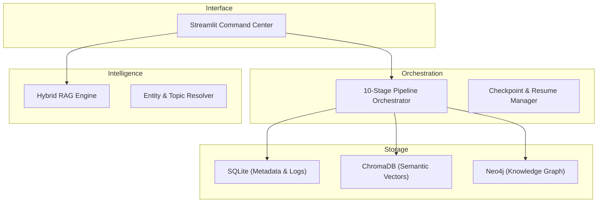

# KnowledgeVault-YT: Local-First Research Intelligence

KnowledgeVault-YT is a specialized research intelligence system that autonomousy ingests, triages, and synthesizes YouTube content into a structured Knowledge Graph. Built with a privacy-first, local-only architecture, it enables high-fidelity knowledge extraction from video transcripts without cloud dependencies.

---

## Core Capabilities

KnowledgeVault-YT delivers professional-grade intelligence through a robust multi-stage pipeline:

*   **Autonomous Ingestion**: Discovers and harvests metadata and transcripts from channels, playlists, or individual videos.
*   **Intelligent Triage**: USes a dual-phase rule and LLM-based system to filter signal from noise, ensuring only knowledge-dense content is indexed.
*   **Hybrid Three-Layer Storage**: Combines relational (SQLite), vector (ChromaDB), and graph (Neo4j) databases for comprehensive retrieval.
*   **Advanced RAG Engine**: Performs hybrid semantic and full-text search with timestamped citations and source-backed synthesis.
*   **Knowledge Graph Synthesis**: Maps entities, topics, and claims across different sources to reveal hidden connections and thematic evolution.
*   **Resilient Orchestration**: Features a 10-stage pipeline with atomic checkpoints, enabling reliable resumption after interruptions.

---

## Quick Start

### Prerequisites

| Requirement | Purpose |
|---|---|
| Python 3.11+ | Runtime |
| Ollama | Local LLM inference |
| Docker | Containerized deployment (recommended) |

### Installation (Docker Compose)

1.  **Clone and Navigate**:
    ```bash
    git clone https://github.com/your-repo/knowledgeVault-YT.git
    cd knowledgeVault-YT
    ```
2.  **Start Services**:
    ```bash
    docker compose up -d
    ```
3.  **Prepare Models**:
    ```bash
    docker compose exec ollama ollama pull llama3.2:3b
    docker compose exec ollama ollama pull llama3.1:8b
    docker compose exec ollama ollama pull nomic-embed-text
    ```
4.  **Access UI**:
    Open `http://localhost:8501` to access the Command Center.

For detailed local installation and configuration instructions, see the [User Guide](docs/guides/user_guide.md).

---

## System Architecture

The platform employs a modular architecture designed for failure isolation and consistent data integrity.



Detailed technical specifications and design patterns are available in the [System Architecture Guide](docs/core/system_architecture.md).

---

## Documentation

| Document | Description |
|---|---|
| [System Architecture](docs/core/system_architecture.md) | Technical design, data flow, and schema specifications. |
| [User Guide](docs/guides/user_guide.md) | Comprehensive setup, workflow, and maintenance instructions. |
| [API Reference](docs/core/api_reference.md) | Detailed documentation of modules and internal functions. |
| [Configuration](docs/core/configuration.md) | Guide for tuning pipeline thresholds and LLM settings. |
| [Logging & Monitoring](docs/core/logging_and_monitoring.md) | Operational guide for logs, data management, and troubleshooting. |

---

## Project Structure

```
knowledgeVault-YT/
├── config/             # System configuration and LLM prompts
├── docs/               # Reorganized documentation hierarchy
│   ├── core/           # Technical specifications and API guides
│   ├── guides/         # Installation and user workflows
│   ├── reports/        # Research analysis and roadmaps
│   └── archive/        # Legacy and reference documents
├── src/                # Core application source code
├── tests/              # Comprehensive test suite
├── docker-compose.yml  # Deployment configuration
└── pyproject.toml      # Project dependencies and metadata
```

---

## License

This project is licensed under the MIT License. See [LICENSE](LICENSE) for details.
       # Architecture & Specs
│   └── usage/                     # User guides & Quickstarts
├── scripts/                       # Maintenance scripts
├── src/                           # Source Code
│   ├── main.py                    # CLI entry point
│   ├── ingestion/                 # 10-stage pipeline modules
│   ├── intelligence/              # AI/RAG features
│   ├── pipeline/                  # Orchestration logic
│   ├── storage/                   # Triple-store (SQL/Vector/Graph)
│   ├── ui/                        # Streamlit interface
│   └── utils/                     # Shared utilities
├── tests/                         # Comprehensive test suite
│   ├── ui/                        # UI-specific tests
│   └── utils/                     # Utility tests
├── docker-compose.yml
├── Dockerfile
└── pyproject.toml
```

---

## 🔧 Hardware Requirements

| Component | Minimum | Recommended |
|---|---|---|
| CPU | 4-core x86_64 | 8-core |
| RAM | 16 GB | 32 GB |
| GPU | None (CPU-only) | 8 GB VRAM (RTX 3060+) |
| Storage | 20 GB free | 50 GB SSD |

---

## 📄 License

MIT License — see [LICENSE](LICENSE) for details.

---

<div align="center">

**Built with** 🐍 Python • 🦙 Ollama • 🔍 ChromaDB • 🕸️ Neo4j • 🎯 Streamlit

</div>
