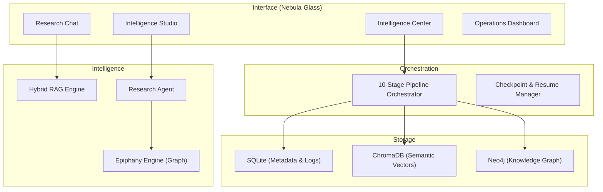

# KnowledgeVault-YT: Professional Research Intelligence OS

KnowledgeVault-YT is a specialized research intelligence system that autonomously ingests, triages, and synthesizes YouTube content into a structured Knowledge Graph. Built with a privacy-first, local-only architecture, it enables high-fidelity knowledge extraction from video transcripts without cloud dependencies.

---

## ✦ System Capabilities

KnowledgeVault-YT delivers professional-grade intelligence through a robust multi-stage pipeline:

*   **Intelligence Studio**: A deep synthesis hub featuring an Analytical Lab (Knowledge Maps, Topic Clusters), Comparative Studio (multi-source analysis), and a Research Agent for autonomous formal briefings.
*   **Autonomous Ingestion Hub**: Discovers and harvests metadata and transcripts from channels, playlists, or individual videos with robust URL validation and bulk processing.
*   **Research Chat (RAG)**: A conversational intelligence interface with session history, citation-backed answers, and one-click discovery bookmarking.
*   **Hybrid Three-Layer Storage**: Combines relational (SQLite), vector (ChromaDB), and graph (Neo4j) databases for comprehensive retrieval and connection discovery.
*   **Intelligent Triage Engine**: Uses a dual-phase LLM system (Rules + LLM Classifier) to filter signal from noise, ensuring only knowledge-dense content enters the vault.
*   **Operational Resilience**: 10-stage pipeline with atomic checkpoints, fleet monitoring, and automated vault health repair utilities.
*   **Atmospheric Design**: A premium "Nebula-Glass" aesthetic with native Dark (Void Nebula) and Light (Stellar Lab) mode toggles.

---

## 🎯 Use Cases

*   **Cross-Channel Trend Analysis**: Identify how different experts discuss the same topic over time.
*   **Technical Mastery**: Extract actionable "Execution Blueprints" from tutorials with timestamped steps.
*   **Authority Discovery**: Map "Guest Networks" to find key opinion leaders and their appearances across different channels.
*   **Knowledge Gap Identification**: Automatically detect topics in your vault that lack sufficient evidence or multi-source validation.
*   **Autonomous Briefing**: Generate formal research papers and "Epiphany Briefings" on complex subjects using your private knowledge base.

---

## 📖 Documentation

| Document | Description |
|---|---|
| [User Guide](docs/guides/user_guide.md) | Comprehensive setup, workflow, and maintenance instructions. |
| [System Architecture](docs/core/system_architecture.md) | Technical design, data flow, and schema specifications. |
| [Logging & Monitoring](docs/core/logging_and_monitoring.md) | Operational guide for logs, data management, and troubleshooting. |
| [Quality Audit Report](docs/reports/AUDIT_REPORT_E2E_QUALITY.md) | Detailed findings from the Phase 3 quality remediation sprint. |
| [API Reference](docs/core/api_reference.md) | Detailed documentation of modules and internal functions. |

---

## 🚀 Quick Start

### Prerequisites

| Requirement | Purpose |
|---|---|
| **Python 3.11+** | Core Runtime |
| **Ollama** | Local LLM inference (**Llama 3.2** + **Nomic Embed**) |
| **Docker Compose** | Production-grade deployment (Recommended) |
| **Neo4j** | Graph database (Included in Docker) |

### Installation (Docker)

1.  **Clone and Navigate**:
    ```bash
    git clone https://github.com/AmanGarg1999/YTVault.git
    cd YTVault
    ```
2.  **Start Services**:
    ```bash
    docker compose up -d
    ```
3.  **Access UI**:
    Open `http://localhost:8501` to access the Intelligence OS.

---

## 🏛 Architecture

The platform employs a modular architecture designed for failure isolation and consistent data integrity.



---

## 📦 Data Portability & Collaboration

*   **Vault Snapshots**: Generate portable `.kvvault` ZIP packages containing your entire database and intelligence logs.
*   **Obsidian Sync**: One-click generation of a Markdown-based knowledge base for Obsidian.
*   **Mission Packages**: Export specific research missions or chat briefings for collaboration with other investigators.

---

## 🔒 Security & Privacy

KnowledgeVault-YT is **Local-First**:
*   **No API Keys Required**: Uses Ollama for local LLM inference.
*   **No Cloud Tracking**: All video transcripts and analysis remain in your private volumes.
*   **Audit-Ready**: Full deletion history and soft-delete (Recycle Bin) capabilities ensure data sovereignty.

---

<div align="center">

**Built with** 🐍 Python • 🦙 Ollama • 🔍 ChromaDB • 🕸️ Neo4j • 🎯 Streamlit

</div>
