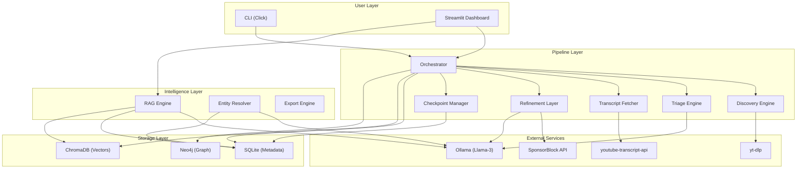

# Architecture Guide

> knowledgeVault-YT System Design & Data Flow

---

## Overview

knowledgeVault-YT follows a **pipeline architecture** with three major subsystems:

1. **Ingestion Pipeline** — Discovers, triages, and refines YouTube content
2. **Hybrid Storage** — Three-layer data architecture (Relational + Vector + Graph)
3. **Intelligence Layer** — RAG synthesis, entity resolution, and export

Each subsystem is designed for **independent failure isolation** — a Neo4j outage, for example, will not prevent the ingestion pipeline from completing.

---

## System Architecture Diagram



---

## Data Flow

### Ingestion Pipeline

The pipeline processes each video through **10 sequential stages**. Each stage transition is atomically committed to SQLite, enabling crash-safe resume.

```
URL Input
  │
  ▼
[1] DISCOVERY ─────── yt-dlp --flat-playlist → Video ID queue
  │                    yt-dlp --dump-json → Metadata harvest
  ▼
[2] TRIAGE ────────── Rule filter (< 1ms) → Accept/Reject/LLM
  │                   LLM classifier (< 2s) → Accept/Reject/Pending
  ▼
[3] TRANSCRIPT ────── youtube-transcript-api → Priority-ordered fetch
  │                   (manual_en → auto_en → manual_any → auto_any)
  ▼
[4] SPONSOR FILTER ── SponsorBlock API → Strip sponsored segments
  │
  ▼
[5] NORMALIZE ─────── Ollama 3B → Remove fillers, fix punctuation
  │
  ▼
[6] CHUNK ─────────── Sliding window (400w) or Semantic (topic boundaries)
  │
  ▼
[7] CHUNK ANALYSIS ── Per-chunk: topics + entities + claims + quotes
  │                   (parallelized via LLMPool, uses both 3B and 8B models)
  ▼
[8] EMBED ─────────── nomic-embed-text → ChromaDB upsert
  │
  ▼
[9] GRAPH SYNC ────── Aggregated chunk data → Neo4j (full video coverage)
  │                   Guest resolution + Topic/Claim/Quote nodes
  ▼
[10] DONE
```

### Query Flow (RAG)

```
User Question (may include channel:, topic:, guest:, after: filters)
  │
  ├──[1]──► Parse structured query filters
  │
  ├──[2]──► ChromaDB semantic search (top-15)
  │
  ├──[3]──► SQLite FTS5 BM25 search (top-15)
  │
  ├──[4]──► Reciprocal Rank Fusion (merge vector + BM25)
  │
  ├──[5]──► Topic-aware Neo4j enrichment (optional)
  │
  ├──[6]──► Deduplicate overlapping chunks
  │
  ├──[7]──► Enrich with SQLite metadata (titles, channels, dates)
  │
  ├──[8]──► Build context prompt with [source_N] citations
  │
  ├──[9]──► Ollama 8B (deep model) synthesis
  │
  └──[10]─► Confidence scoring + YouTube timestamp links
```

### Summarization Flow (Map-Reduce)

```
All Chunks for Video
  │
  ├── MAP PHASE (parallel via LLMPool) ───────────────┐
  │   Group 1 (chunks 1-4) → Bullet summary        │
  │   Group 2 (chunks 5-8) → Bullet summary        │
  │   Group N → Bullet summary                      │
  │                                                  │
  ▼                                                  ▼
  REDUCE PHASE ─────────────────────────────────┐
  All bullet summaries → Ollama 8B → Structured JSON  │
  (summary, topics, takeaways, entities, timeline)   │
  └──────────────────────────────────────────────┘
```

---

## Storage Layer Design

### Why Three Layers?

| Layer | Strength | Weakness |
|---|---|---|
| **SQLite** | Fast structured queries, ACID, zero-config | Can't do semantic similarity |
| **ChromaDB** | Semantic nearest-neighbor search | Can't do structured filtering efficiently |
| **Neo4j** | Relationship traversal, "hidden connections" | Can't do full-text or similarity search |

Each layer handles what it does best. The RAG engine queries **all three** in parallel for the richest possible context.

### SQLite Schema

11 tables (schema version 9) with intentional denormalization for simplicity:

- `channels` — Channel metadata and scan progress
- `videos` — Video metadata, triage status, pipeline checkpoint
- `guests` — Canonical guest names with JSON aliases
- `guest_appearances` — Guest-to-video links with context
- `transcript_chunks` — Raw/cleaned text, timestamps, per-chunk analysis (topics, entities, claims, quotes JSON)
- `scan_checkpoints` — Scan-level resume tracking
- `video_summaries` — Cached map-reduce summaries with topics, takeaways, timeline
- `claims` — Structured assertions extracted from transcripts (speaker, text, topic, confidence)
- `quotes` — Notable quotations extracted from transcripts (speaker, text, topic)
- `pipeline_temp_state` — Intermediate state between pipeline stages
- `chunks_fts` — FTS5 full-text index for BM25 search

Key design choices:
- **WAL journal mode** — Concurrent reads from UI while pipeline writes
- **`checkpoint_stage` on videos** — Per-video resume granularity
- **JSON columns** (`tags_json`, `aliases_json`) — Avoids join-heavy M2M for MVP

### ChromaDB Strategy

- **400-word sliding window** with 80-word overlap
- **`nomic-embed-text`** (768-dim) via Ollama
- **Cosine similarity** for normalized embeddings
- **Rich metadata** on each document: video_id, channel_id, timestamps, language

### Neo4j Graph Schema

5 node types, 8 relationship types:

```
(:Channel)-[:PUBLISHED]->(:Video)
(:Guest)-[:APPEARED_IN {timestamp, context}]->(:Video)
(:Video)-[:DISCUSSES {relevance}]->(:Topic)
(:Guest)-[:EXPERT_ON {mention_count}]->(:Topic)
(:Topic)-[:RELATED_TO {co_occurrence, relationship_type}]->(:Topic)
(:Topic)-[:SUBTOPIC_OF]->(:Topic)           # Hierarchical taxonomy
(:Claim)-[:SOURCED_FROM]->(:Video)          # Assertion tracking
(:Guest)-[:ASSERTED]->(:Claim)              # Who said it
(:Claim)-[:ABOUT]->(:Topic)                 # What it's about
```

`relationship_type` on RELATED_TO: `CONSENSUS`, `CONTRADICTION`, `COMPLEMENTARY`, or `EVOLUTION` (set by Epiphany Engine).

---

## Checkpoint System

The checkpoint system guarantees that a 500-video scan can survive interruptions:

1. **Per-video tracking** — Each video has a `checkpoint_stage` column
2. **Atomic commits** — Every stage transition is immediately committed
3. **Scan-level tracking** — `scan_checkpoints` table tracks overall progress
4. **Resume logic** — On resume, each video continues from its last stage

```
METADATA_HARVESTED → TRIAGE_COMPLETE → TRANSCRIPT_FETCHED →
SPONSOR_FILTERED → TEXT_NORMALIZED → CHUNKED →
CHUNK_ANALYZED → EMBEDDED → GRAPH_SYNCED → DONE
```

---

## Performance Targets

| Operation | Target | Actual Strategy |
|---|---|---|
| Metadata harvest | < 500ms | `yt-dlp --dump-json`, async batching |
| Rule-based triage | < 1ms | Pure Python, no I/O |
| LLM triage | < 2s | Short prompt, `num_predict=100` |
| Transcript fetch | < 3s | youtube-transcript-api |
| SponsorBlock | < 500ms | HTTP GET, 5s timeout |
| Text normalize | < 5s/1000w | Chunked Llama-3 inference |
| Embedding | < 100ms/chunk | nomic-embed-text via Ollama |
| RAG query | < 8s | Vector (200ms) + LLM (7s) |

---

## Error Handling

Every external call uses configurable retry with exponential backoff:

```yaml
retry:
  yt_dlp_metadata:  {max_retries: 3, backoff: [1, 5, 15]}
  transcript_fetch: {max_retries: 3, backoff: [2, 10, 30]}
  ollama_inference: {max_retries: 2, backoff: [5, 15]}
```

**Graceful degradation:**
- No SponsorBlock data → Keep full transcript
- No Neo4j connection → Skip graph sync, pipeline continues
- LLM parsing fails → Route to Ambiguity Queue
- No transcript available → Mark video as DONE (skip)
