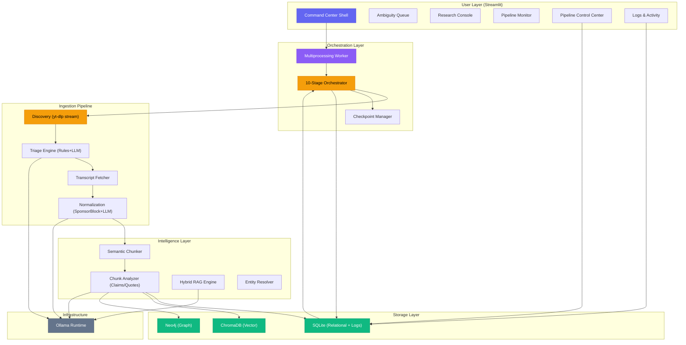
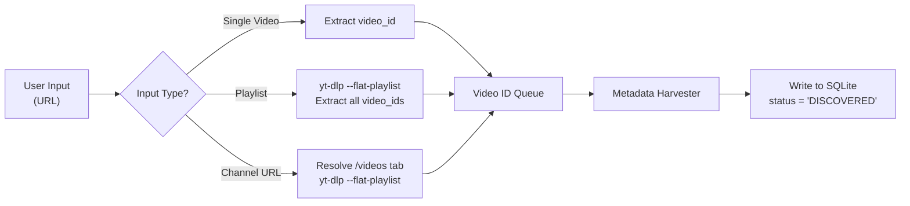
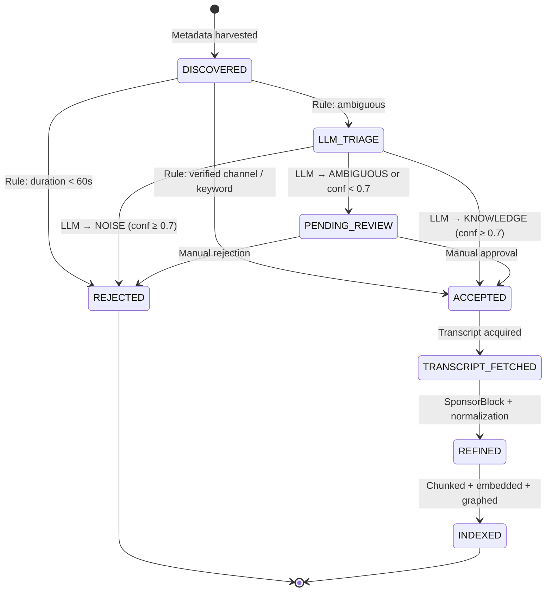
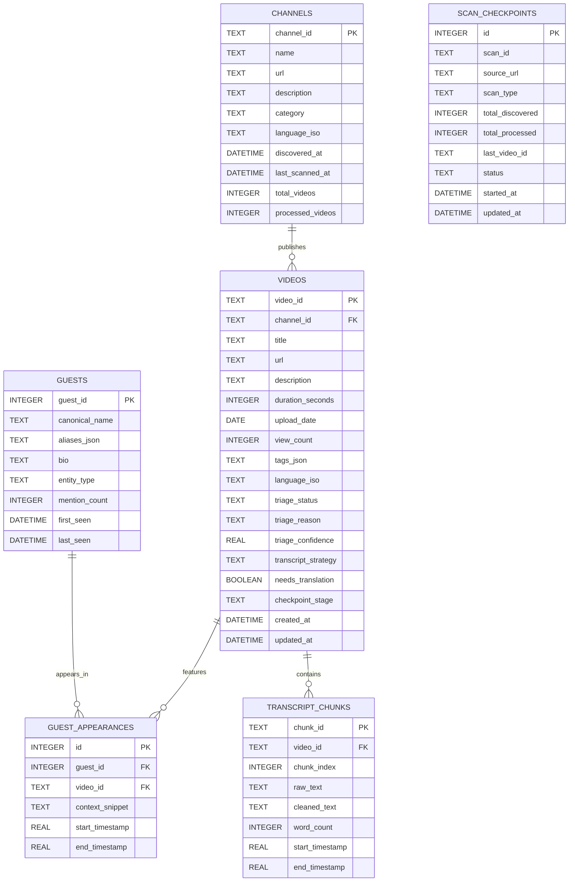
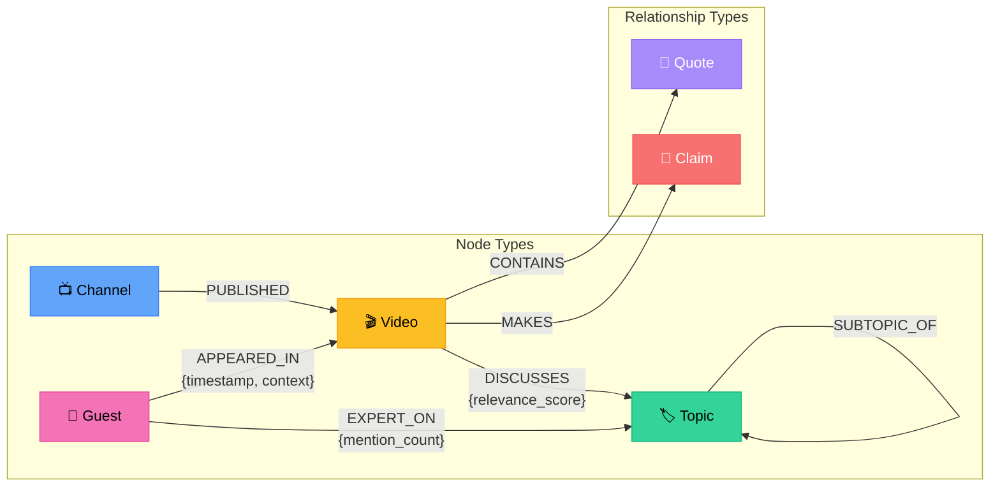
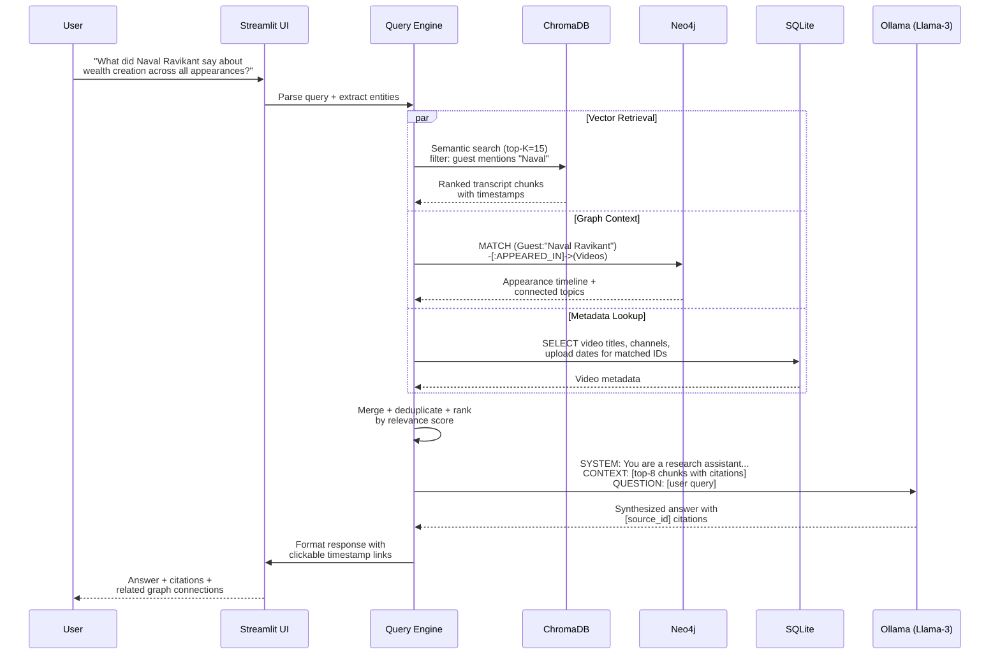
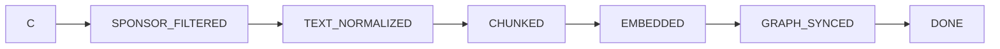

# knowledgeVault-YT: Technical Specification Document

> **Version:** 1.1.0-Stabilized  
> **Date:** 2026-04-04  
> **Classification:** Local-First Research Intelligence System  

---

## Executive Summary

**knowledgeVault-YT** solves the **Knowledge Density Gap**—the systemic friction between YouTube's engagement-optimized design and a researcher's need for structured, queryable intelligence. The platform transforms fragmented video transcripts into a **Contextual Knowledge Graph** through a fully local, privacy-first pipeline combining LLM-driven triage, hybrid storage, and semantic retrieval.

Every architectural decision in this document directly addresses three core friction points:

| Friction Point | Architectural Response |
|---|---|
| **High Noise-to-Signal Ratio** | Multi-stage Triage Engine with LLM metadata classification + SponsorBlock filtering |
| **Temporal Fragmentation** | Cross-channel Guest/Topic Graph (Neo4j) linking entities across time and platforms |
| **Search Limitations** | RAG-powered Semantic Search over vector-embedded transcript chunks with timestamp citations |

---

## 1. System Architecture Overview



---

## 2. Module 1 — Multi-Stage Ingestion & Triage Pipeline

### 2.1 Discovery Logic

The Discovery Engine accepts three input types and normalizes them into a unified video-ID queue.

**Input Resolution Flow:**



**Implementation Details:**

| Component | Tool | Rationale |
|---|---|---|
| URL parsing | `urllib.parse` + regex | Distinguish `/watch`, `/playlist`, `/@channel` patterns |
| Metadata extraction | `yt-dlp --dump-json --no-download` | Extracts all metadata without downloading media (**No Media Download** policy) |
| Rate limiting | `asyncio.Semaphore(3)` | Prevents YouTube throttling; 3 concurrent metadata fetches |
| Deduplication | SQLite `UNIQUE(video_id)` constraint | `INSERT OR IGNORE` prevents re-processing |

**Metadata Fields Harvested per Video:**

```python
METADATA_SCHEMA = {
    "video_id": str,       # YouTube 11-char ID
    "title": str,
    "description": str,    # First 500 chars (triage input)
    "channel_id": str,
    "channel_name": str,
    "duration_seconds": int,
    "upload_date": str,    # ISO 8601
    "view_count": int,
    "tags": list[str],
    "language_iso": str,   # e.g., "en", "hi", "es"
    "has_manual_captions": bool,
    "has_auto_captions": bool,
}
```

### 2.2 The Triage Engine

The Triage Engine is the primary solution to the **High Noise-to-Signal Ratio** problem. It operates in two phases: rule-based pre-filtering and LLM-based semantic classification.

**Phase 1 — Rule-Based Pre-Filter (< 1ms per video):**

```python
def rule_filter(video: VideoMeta) -> TriageDecision:
    # Hard Reject: Ultra-short content (unless whitelisted)
    if video.duration_seconds < 60 and not video.in_shorts_whitelist:
        return TriageDecision.REJECT, "duration_under_60s"

    # Hard Accept: Verified Knowledge channels
    if video.channel_id in VERIFIED_KNOWLEDGE_CHANNELS:
        return TriageDecision.ACCEPT, "verified_channel"

    # Hard Accept: Educational keyword match
    KNOWLEDGE_KEYWORDS = {"lecture", "tutorial", "analysis", "interview",
                          "podcast", "documentary", "explained", "deep dive"}
    title_lower = video.title.lower()
    if any(kw in title_lower for kw in KNOWLEDGE_KEYWORDS):
        return TriageDecision.ACCEPT, "keyword_match"

    return TriageDecision.NEEDS_LLM, "ambiguous"
```

**Phase 2 — LLM Metadata Classifier (target < 2s per video):**

Only videos that pass through Phase 1 as `NEEDS_LLM` are sent to the local Ollama instance. This minimizes LLM calls and ensures the **< 2 second performance target**.

```
SYSTEM PROMPT (Triage Classifier):
─────────────────────────────────
You are a content classifier for a research intelligence system.
Given a video's TITLE, DESCRIPTION (first 500 chars), DURATION, and TAGS,
classify it into exactly ONE category:

- KNOWLEDGE: Technical, educational, historical, scientific, interview/podcast
  content with high information density.
- NOISE: Vlogs, memes, comedy skits, reaction videos, gaming highlights,
  unboxing, or entertainment-first content.
- AMBIGUOUS: Cannot be clearly classified from metadata alone.

Respond with ONLY a JSON object:
{"category": "KNOWLEDGE|NOISE|AMBIGUOUS", "confidence": 0.0-1.0, "reason": "brief explanation"}
```

**Triage State Machine:**



**Ambiguity Queue Management:**

Videos routed to `PENDING_REVIEW` are surfaced in the Streamlit UI with:
- Title, thumbnail URL, duration, and channel name
- The LLM's `reason` and `confidence` score
- One-click **Accept** / **Reject** buttons
- Batch operations for bulk review

### 2.3 Refinement Layer

Once a video is `ACCEPTED`, the Refinement Layer cleans its transcript to maximize signal density.

**Step 1 — Transcript Acquisition:**

```python
def acquire_transcript(video_id: str) -> TranscriptResult:
    """Priority-ordered transcript fetching."""
    strategies = [
        ("manual_en", {"languages": ["en"], "type": "manual"}),
        ("auto_en",   {"languages": ["en"], "type": "generated"}),
        ("manual_any", {"type": "manual"}),       # Flag for translation
        ("auto_any",   {"type": "generated"}),     # Flag for translation
    ]
    for strategy_name, params in strategies:
        transcript = youtube_transcript_api.get(video_id, **params)
        if transcript:
            return TranscriptResult(
                text=transcript,
                strategy=strategy_name,
                language_iso=transcript.language_code,
                needs_translation=(strategy_name in ("manual_any", "auto_any")),
            )
    return TranscriptResult(text=None, strategy="none", error="no_transcript")
```

**Step 2 — SponsorBlock Integration:**

```python
SPONSORBLOCK_API = "https://sponsor.ajay.app/api/skipSegments"

def get_sponsor_segments(video_id: str) -> list[Segment]:
    """Fetch crowd-sourced sponsor/intro/outro timestamps."""
    params = {
        "videoID": video_id,
        "categories": '["sponsor","selfpromo","interaction","intro","outro"]'
    }
    response = requests.get(SPONSORBLOCK_API, params=params, timeout=5)
    if response.status_code == 200:
        return [Segment(s["startTime"], s["endTime"], s["category"])
                for s in response.json()]
    return []  # Graceful fallback: keep full transcript

def strip_sponsored_text(transcript_segments, sponsor_segments):
    """Remove transcript lines that fall within sponsor time ranges."""
    return [seg for seg in transcript_segments
            if not any(sp.start <= seg.timestamp <= sp.end
                       for sp in sponsor_segments)]
```

**Step 3 — Text Normalization (via Llama-3-8B-Instruct):**

```
SYSTEM PROMPT (Text Normalizer):
─────────────────────────────────
You are a transcript normalizer. Given a raw transcript chunk:
1. Remove verbal fillers: "um", "uh", "like", "you know", "basically",
   "sort of", "kind of", "I mean", "right?"
2. Fix punctuation and sentence boundaries.
3. Merge broken sentences caused by caption timing.
4. Preserve ALL factual content, technical terms, and proper nouns exactly.
5. Do NOT summarize or paraphrase. Output the cleaned transcript only.
```

**Processing is chunked** into 1000-word windows with 100-word overlap to stay within the model's context window while preserving sentence continuity.

---

## 3. Module 2 — Hybrid Data Architecture (Three-Layer Strategy)

### 3.1 Entity-Relationship Diagram



### 3.2 Layer 1 — Relational (SQLite)

> **Why SQLite over PostgreSQL for MVP:** Zero-config, single-file deployment, WAL mode for concurrent reads, and sufficient performance for single-user research workloads. Migration to PostgreSQL is trivial via SQLAlchemy ORM.

**Key Design Decisions:**

| Decision | Rationale |
|---|---|
| `triage_status` as TEXT enum | Values: `DISCOVERED`, `ACCEPTED`, `REJECTED`, `PENDING_REVIEW`, `TRANSCRIPT_FETCHED`, `REFINED`, `INDEXED` — tracks pipeline stage |
| `language_iso` on both Channel and Video | Channels may be multilingual; per-video tagging ensures **Language Integrity** |
| `tags_json` as serialized JSON | Avoids a join-heavy many-to-many for MVP; queryable via `json_extract()` |
| WAL journal mode | Enables concurrent read access from the Streamlit UI while the pipeline writes |
| `checkpoint_stage` on Videos | Enables granular resume for the Checkpoint System |

**SQLite Initialization:**

```sql
PRAGMA journal_mode = WAL;
PRAGMA foreign_keys = ON;
PRAGMA busy_timeout = 5000;

CREATE TABLE IF NOT EXISTS channels (
    channel_id    TEXT PRIMARY KEY,
    name          TEXT NOT NULL,
    url           TEXT NOT NULL,
    description   TEXT,
    category      TEXT DEFAULT 'UNCLASSIFIED',
    language_iso  TEXT DEFAULT 'en',
    discovered_at DATETIME DEFAULT CURRENT_TIMESTAMP,
    last_scanned_at DATETIME,
    total_videos  INTEGER DEFAULT 0,
    processed_videos INTEGER DEFAULT 0
);

CREATE TABLE IF NOT EXISTS videos (
    video_id         TEXT PRIMARY KEY,
    channel_id       TEXT REFERENCES channels(channel_id),
    title            TEXT NOT NULL,
    url              TEXT NOT NULL,
    description      TEXT,
    duration_seconds INTEGER,
    upload_date      DATE,
    view_count       INTEGER,
    tags_json        TEXT DEFAULT '[]',
    language_iso     TEXT DEFAULT 'en',
    triage_status    TEXT DEFAULT 'DISCOVERED',
    triage_reason    TEXT,
    triage_confidence REAL,
    transcript_strategy TEXT,
    needs_translation BOOLEAN DEFAULT 0,
    checkpoint_stage TEXT DEFAULT 'METADATA_HARVESTED',
    created_at       DATETIME DEFAULT CURRENT_TIMESTAMP,
    updated_at       DATETIME DEFAULT CURRENT_TIMESTAMP
);

CREATE INDEX idx_videos_triage ON videos(triage_status);
CREATE INDEX idx_videos_channel ON videos(channel_id);
CREATE INDEX idx_videos_checkpoint ON videos(checkpoint_stage);

CREATE TABLE IF NOT EXISTS guests (
    guest_id       INTEGER PRIMARY KEY AUTOINCREMENT,
    canonical_name TEXT NOT NULL UNIQUE,
    aliases_json   TEXT DEFAULT '[]',
    bio            TEXT,
    entity_type    TEXT DEFAULT 'PERSON',
    mention_count  INTEGER DEFAULT 0,
    first_seen     DATETIME DEFAULT CURRENT_TIMESTAMP,
    last_seen      DATETIME DEFAULT CURRENT_TIMESTAMP
);

CREATE TABLE IF NOT EXISTS guest_appearances (
    id             INTEGER PRIMARY KEY AUTOINCREMENT,
    guest_id       INTEGER REFERENCES guests(guest_id),
    video_id       TEXT REFERENCES videos(video_id),
    context_snippet TEXT,
    start_timestamp REAL,
    end_timestamp   REAL,
    UNIQUE(guest_id, video_id, start_timestamp)
);

CREATE TABLE IF NOT EXISTS transcript_chunks (
    chunk_id    TEXT PRIMARY KEY,
    video_id    TEXT REFERENCES videos(video_id),
    chunk_index INTEGER,
    raw_text    TEXT,
    cleaned_text TEXT,
    word_count  INTEGER,
    start_timestamp REAL,
    end_timestamp   REAL
);

CREATE TABLE IF NOT EXISTS scan_checkpoints (
    id               INTEGER PRIMARY KEY AUTOINCREMENT,
    scan_id          TEXT NOT NULL UNIQUE,
    source_url       TEXT NOT NULL,
    scan_type        TEXT NOT NULL,
    total_discovered INTEGER DEFAULT 0,
    total_processed  INTEGER DEFAULT 0,
    last_video_id    TEXT,
    status           TEXT DEFAULT 'IN_PROGRESS',
    started_at       DATETIME DEFAULT CURRENT_TIMESTAMP,
    updated_at       DATETIME DEFAULT CURRENT_TIMESTAMP
);

-- Version 10: Pipeline activity logging
CREATE TABLE IF NOT EXISTS pipeline_logs (
    log_id      INTEGER PRIMARY KEY AUTOINCREMENT,
    scan_id     TEXT DEFAULT '',
    video_id    TEXT DEFAULT '',
    channel_id  TEXT DEFAULT '',
    level       TEXT DEFAULT 'INFO',
    stage       TEXT DEFAULT '',
    message     TEXT NOT NULL,
    error_detail TEXT DEFAULT '',
    timestamp   DATETIME DEFAULT CURRENT_TIMESTAMP,
    created_at  DATETIME DEFAULT CURRENT_TIMESTAMP
);

-- Version 11: Pipeline control state
CREATE TABLE IF NOT EXISTS pipeline_control (
    control_id  INTEGER PRIMARY KEY AUTOINCREMENT,
    scan_id     TEXT NOT NULL UNIQUE,
    status      TEXT DEFAULT 'RUNNING',
    pause_reason TEXT DEFAULT '',
    resumed_at  DATETIME,
    stopped_at  DATETIME,
    created_at  DATETIME DEFAULT CURRENT_TIMESTAMP,
    updated_at  DATETIME DEFAULT CURRENT_TIMESTAMP
);

-- Version 12: Video deletion history
CREATE TABLE IF NOT EXISTS deletion_history (
    deletion_id INTEGER PRIMARY KEY AUTOINCREMENT,
    deletion_type TEXT NOT NULL,
    channel_id TEXT DEFAULT '',
    video_id TEXT DEFAULT '',
    deleted_by TEXT DEFAULT 'user',
    reason TEXT DEFAULT '',
    data_deleted TEXT DEFAULT '[]',
    deleted_at DATETIME DEFAULT CURRENT_TIMESTAMP
);
```

### 3.3 Layer 2 — Vector (ChromaDB)

**Chunking Strategy — Sliding Window:**

The **300–500 word sliding window** approach is critical for semantic retrieval accuracy. Too-small chunks lose context; too-large chunks dilute relevance.

```python
def sliding_window_chunk(
    cleaned_text: str,
    video_id: str,
    timestamps: list[TimestampedSegment],
    window_size: int = 400,      # target words per chunk
    overlap: int = 80            # overlap words for continuity
) -> list[Chunk]:
    words = cleaned_text.split()
    chunks = []
    start = 0
    chunk_index = 0

    while start < len(words):
        end = min(start + window_size, len(words))
        chunk_text = " ".join(words[start:end])

        # Map word positions back to video timestamps
        start_ts = estimate_timestamp(start, timestamps)
        end_ts = estimate_timestamp(end, timestamps)

        chunk_id = f"{video_id}__chunk_{chunk_index:04d}"
        chunks.append(Chunk(
            chunk_id=chunk_id,
            video_id=video_id,
            chunk_index=chunk_index,
            text=chunk_text,
            word_count=end - start,
            start_timestamp=start_ts,
            end_timestamp=end_ts,
        ))

        start += window_size - overlap
        chunk_index += 1

    return chunks
```

**ChromaDB Collection Schema:**

```python
import chromadb

client = chromadb.PersistentClient(path="./data/chromadb")

collection = client.get_or_create_collection(
    name="transcript_chunks",
    metadata={"hnsw:space": "cosine"},  # Cosine similarity for normalized embeddings
    embedding_function=OllamaEmbeddingFunction(
        model_name="nomic-embed-text",   # 768-dim, runs locally via Ollama
        url="http://localhost:11434",
    ),
)

# Upsert chunks with rich metadata for filtered retrieval
collection.upsert(
    ids=[c.chunk_id for c in chunks],
    documents=[c.text for c in chunks],
    metadatas=[{
        "video_id": c.video_id,
        "channel_id": video.channel_id,
        "chunk_index": c.chunk_index,
        "start_timestamp": c.start_timestamp,
        "end_timestamp": c.end_timestamp,
        "upload_date": video.upload_date,
        "language_iso": video.language_iso,
    } for c in chunks],
)
```

**Embedding Model Selection:**

| Model | Dimensions | Speed (local) | Quality | Choice |
|---|---|---|---|---|
| `nomic-embed-text` | 768 | ~50ms/chunk | High |  **Selected** |
| `all-minilm` | 384 | ~30ms/chunk | Medium | Fallback |
| `mxbai-embed-large` | 1024 | ~80ms/chunk | Very High | Future upgrade |

### 3.4 Layer 3 — Graph (Neo4j)

The Graph Layer is the direct architectural response to **Temporal Fragmentation**. It reveals cross-channel connections that are invisible in flat relational or vector stores.

**Graph Schema:**



### 3.5 Automated Taxonomy Building

The `TaxonomyBuilder` autonomously organizes the flat topic list into a hierarchical structure.

- **Process**: Queries all topics → Batches (50) → LLM Classifies `child → parent` → Creates `SUBTOPIC_OF` relationships.
- **Outcome**: Enables "Zoom-out" discovery (e.g., browsing "Machine Learning" to find "Transformers").

### 3.6 Epiphany Engine: Cross-Channel Insight Generation

The `EpiphanyEngine` moves beyond simple search to active insight discovery.

**Relationship Classification Model:**

| Relationship | Definition | Graph Effect |
|---|---|---|
| **CONSENSUS** | Multiple channels agree on a fact/topic | Strengthens `RELATED_TO` weight |
| **CONTRADICTION** | Channels hold opposing views | Creates `DEBATES` relationship |
| **COMPLEMENTARY** | Each channel adds unique facets | Links topics with `EXTENDS` |
| **EVOLUTION** | Perspective changes over time | Links timestamps with `EVOLVED_TO` |

**Discovery Flow**:
1. Scan graph for topics discussed by 2+ channels.
2. Trigger RAG query: "Compare and contrast channel A and B on topic X".
3. LLM classifies relationship and generates a synthesis briefing.
4. Update graph with relationship types.

**Cypher Schema Definition:**

```cypher
// Constraints
CREATE CONSTRAINT unique_video IF NOT EXISTS FOR (v:Video) REQUIRE v.video_id IS UNIQUE;
CREATE CONSTRAINT unique_channel IF NOT EXISTS FOR (c:Channel) REQUIRE c.channel_id IS UNIQUE;
CREATE CONSTRAINT unique_guest IF NOT EXISTS FOR (g:Guest) REQUIRE g.canonical_name IS UNIQUE;
CREATE CONSTRAINT unique_topic IF NOT EXISTS FOR (t:Topic) REQUIRE t.name IS UNIQUE;

// Indexes for fast traversal
CREATE INDEX video_title IF NOT EXISTS FOR (v:Video) ON (v.title);
CREATE INDEX guest_name IF NOT EXISTS FOR (g:Guest) ON (g.canonical_name);
CREATE INDEX topic_name IF NOT EXISTS FOR (t:Topic) ON (t.name);
```

**Cross-Channel Query Examples:**

```cypher
// Find all channels where Guest "Elon Musk" appeared
MATCH (g:Guest {canonical_name: "Elon Musk"})-[a:APPEARED_IN]->(v:Video)<-[:PUBLISHED]-(c:Channel)
RETURN c.name, v.title, a.timestamp, v.upload_date
ORDER BY v.upload_date DESC;

// Discover "hidden" topic connections across channels
MATCH (c1:Channel)-[:PUBLISHED]->(v1:Video)-[:DISCUSSES]->(t:Topic)<-[:DISCUSSES]-(v2:Video)<-[:PUBLISHED]-(c2:Channel)
WHERE c1 <> c2
RETURN t.name, c1.name, c2.name, COUNT(*) AS connection_strength
ORDER BY connection_strength DESC
LIMIT 20;

// Track how a guest's discussed topics evolved over time
MATCH (g:Guest {canonical_name: "Lex Fridman"})-[:APPEARED_IN]->(v:Video)-[:DISCUSSES]->(t:Topic)
RETURN t.name, v.upload_date, v.title
ORDER BY v.upload_date;
```

---

## 4. Module 3 — Intelligence & Interaction Layer

### 4.1 Semantic Synthesis (RAG Flow)

The RAG engine directly addresses **Search Limitations** by enabling natural language queries against the semantic content of transcripts rather than keyword/tag matching.

**RAG Pipeline Architecture:**



**RAG System Prompt:**

```
SYSTEM PROMPT (Research Synthesizer):
─────────────────────────────────────
You are a research assistant for a Knowledge Vault system. You synthesize
answers STRICTLY from the provided context chunks. Follow these rules:

1. CITE every claim using [source_N] notation matching the provided chunk IDs.
2. Include VIDEO TIMESTAMPS when available, formatted as [MM:SS].
3. If the context is insufficient to answer, say "Insufficient context" and
   suggest which channels or topics to ingest next.
4. NEVER fabricate information not present in the context.
5. When multiple sources discuss the same point, note the agreement or
   contradiction between them.
6. Organize the answer chronologically when tracking perspective evolution.
```

### 4.2 Deep Chunk Analysis (The "Claim/Quote" Extraction)

Unlike standard RAG which only indexes text, `knowledgeVault-YT` performs a structured deep-dive on every 400-word chunk.

- **Fast Model (3B)**: Extract topics and entities.
- **Deep Model (8B)**: Extract citable **Claims** (assertions of fact) and **Quotes** (notable verbatim statements).
- **Persistence**: Structured data is stored in dedicated SQLite tables for precise attribute-based filtering (e.g., `SELECT quote FROM quotes WHERE speaker = 'Naval'`).

### 4.3 Map-Reduce Summarization

To handle long videos without context window exhaustion or "lost in the middle" effects, the `SummarizerEngine` uses a Map-Reduce architecture.

1. **Map Phase**: Groups of 4 chunks are summarized into dense bullet points (parallelized via `LLMPool`).
2. **Reduce Phase**: All bullet groups are synthesized by a deep LLM into a final structured JSON.
3. **Output Schema**:
   - `summary`: One-paragraph high-level narrative.
   - `takeaways`: 5-7 actionable citable points.
   - `narrative_timeline`: Key segments with timestamps.
   - `primary_entities`: Resolved guests and organizations.

**Retrieval Configuration:**

```python
RAG_CONFIG = {
    "vector_top_k": 15,              # Initial retrieval breadth
    "rerank_top_k": 8,               # Final context window after reranking
    "similarity_threshold": 0.65,     # Minimum cosine similarity
    "max_context_tokens": 4096,       # Fits Llama-3 8K context
    "chunk_overlap_dedup": True,      # Remove overlapping sliding-window chunks
    "metadata_filters": {
        "language_iso": "en",          # Default; user-configurable
    },
}
```

### 4.2 Cross-Channel Guest Mapping

The Entity Resolution module identifies when the same person appears across different channels, enabling the tracking of evolving perspectives — directly solving **Temporal Fragmentation**.

**Entity Resolution Pipeline:**

```python
class GuestResolver:
    """Resolves guest entities across channels using fuzzy matching + LLM."""

    def __init__(self, db, ollama_client):
        self.db = db
        self.llm = ollama_client

    def extract_entities(self, cleaned_text: str, video_id: str) -> list[Entity]:
        """Phase 1: NER extraction from transcript chunks."""
        prompt = f"""Extract all PERSON entities mentioned in this transcript.
        For each person, provide:
        - name: their full name as mentioned
        - role: their role if stated (host, guest, expert, etc.)
        - context: the sentence where they are mentioned

        Transcript: {cleaned_text[:2000]}

        Respond as JSON array: [{{"name": "", "role": "", "context": ""}}]"""

        return self.llm.generate(prompt, format="json")

    def resolve_to_canonical(self, entity_name: str) -> Guest:
        """Phase 2: Match extracted name to canonical guest record."""
        # Step 1: Exact match
        guest = self.db.find_guest_exact(entity_name)
        if guest:
            return guest

        # Step 2: Fuzzy match (Levenshtein distance ≤ 2)
        candidates = self.db.find_guest_fuzzy(entity_name, threshold=0.85)
        if len(candidates) == 1:
            # Add as alias
            self.db.add_guest_alias(candidates[0].guest_id, entity_name)
            return candidates[0]

        # Step 3: LLM disambiguation for multiple candidates
        if len(candidates) > 1:
            return self._llm_disambiguate(entity_name, candidates)

        # Step 4: Create new guest record
        return self.db.create_guest(canonical_name=entity_name)

    def _llm_disambiguate(self, name, candidates):
        """Use LLM to decide if name matches an existing guest."""
        prompt = f"""Is "{name}" the same person as any of these?
        {[c.canonical_name + ' (aliases: ' + str(c.aliases) + ')' for c in candidates]}
        Respond with the matching name or "NEW" if it's a different person."""
        # ...
```

**Graph Update on Resolution:**

```cypher
// When a guest is resolved, create/update graph relationships
MERGE (g:Guest {canonical_name: $guest_name})
ON CREATE SET g.entity_type = $entity_type, g.first_seen = datetime()
SET g.last_seen = datetime(), g.mention_count = g.mention_count + 1

WITH g
MATCH (v:Video {video_id: $video_id})
MERGE (g)-[r:APPEARED_IN]->(v)
SET r.timestamp = $timestamp, r.context = $context_snippet;
```

### 4.3 Command Center UI (Streamlit)

**Dashboard Layout:**

| Panel | Purpose | Key Widgets |
|---|---|---|
| **Harvest Manager** | Start new ingestion jobs | URL input, Start/Pause/Resume buttons, channel preview |
| **Pipeline Monitor** | Real-time progress tracking | Multi-stage progress bars: Discovered → Triaged → Refined → Indexed |
| **Ambiguity Queue** | Manual review of uncertain classifications | Card grid with Accept/Reject/Batch actions |
| **Research Console** | Semantic search interface | Query input, cited answer display, timestamp links |
| **Knowledge Graph Explorer** | Visual graph navigation | Interactive Neo4j visualization (via `streamlit-agraph`) |
| **Logs & Activity** | Pipeline event monitoring | Live feed, error analysis, and per-video timelines |
| **Pipeline Control** | Active scan management | Pause/Resume/Stop controls and queue management |
| **Data Management** | Data deletion and audit | Safe cascading deletion with impact preview |
| **Export Center** | Data export | Format selector (MD/JSON/CSV), scope filters |

**Pipeline Monitor Widget:**

```python
import streamlit as st

def render_pipeline_monitor(db):
    """Real-time pipeline progress dashboard."""
    stats = db.get_pipeline_stats()

    col1, col2, col3, col4 = st.columns(4)
    col1.metric("📥 Discovered", stats["discovered"])
    col2.metric(" Triage Passed", stats["accepted"])
    col3.metric("📝 Transcripts Cleaned", stats["refined"])
    col4.metric("🔍 Indexed", stats["indexed"])

    # Multi-stage progress bar
    if stats["discovered"] > 0:
        progress = stats["indexed"] / stats["discovered"]
        st.progress(progress, text=f"Overall: {progress:.0%}")

    # Pending review alert
    pending = stats.get("pending_review", 0)
    if pending > 0:
        st.warning(f"️ {pending} videos awaiting manual review")
```

---

## 5. Module 4 — Resilience & Performance Specs

### 5.1 Checkpoint System

The Checkpoint System guarantees that a scan of 500+ videos can survive interruptions (power loss, network failure, user stop) and resume from the exact point of failure.

**Design Principle:** Every state transition in the pipeline is committed to SQLite before proceeding to the next step. The `checkpoint_stage` column on the Videos table acts as a per-video state machine.

**Checkpoint Stages (10-Stage Pipeline):**



**Resume Logic:**

```python
class CheckpointManager:
    """Manages scan resumption after interruption."""

    STAGE_ORDER = [
        "METADATA_HARVESTED", "TRIAGE_COMPLETE", "TRANSCRIPT_FETCHED",
        "SPONSOR_FILTERED", "TEXT_NORMALIZED", "CHUNKED",
        "EMBEDDED", "GRAPH_SYNCED", "DONE"
    ]

    def get_resumable_videos(self, scan_id: str) -> list[Video]:
        """Get all videos that haven't reached DONE status."""
        return self.db.execute("""
            SELECT v.* FROM videos v
            JOIN scan_checkpoints sc ON sc.scan_id = ?
            WHERE v.checkpoint_stage != 'DONE'
              AND v.triage_status = 'ACCEPTED'
            ORDER BY v.created_at ASC
        """, (scan_id,)).fetchall()

    def advance_checkpoint(self, video_id: str, new_stage: str):
        """Atomically advance a video's pipeline stage."""
        self.db.execute("""
            UPDATE videos
            SET checkpoint_stage = ?, updated_at = CURRENT_TIMESTAMP
            WHERE video_id = ?
        """, (new_stage, video_id))
        self.db.commit()  # Immediate commit — crash-safe

    def resume_scan(self, scan_id: str):
        """Resume a scan from where it left off."""
        checkpoint = self.db.get_checkpoint(scan_id)
        if not checkpoint:
            raise ValueError(f"No checkpoint found for scan: {scan_id}")

        pending = self.get_resumable_videos(scan_id)
        logger.info(f"Resuming scan {scan_id}: {len(pending)} videos remaining")

        for video in pending:
            stage_idx = self.STAGE_ORDER.index(video.checkpoint_stage)
            # Resume from the NEXT stage after the last completed one
            remaining_stages = self.STAGE_ORDER[stage_idx:]
            self._process_from_stage(video, remaining_stages)
```

**Scan-Level Checkpoint (for Discovery):**

```python
def discover_channel_videos(channel_url: str, scan_id: str):
    """Discovery with checkpoint support for large channels."""
    checkpoint = db.get_or_create_checkpoint(scan_id, channel_url)

    # yt-dlp provides videos in reverse-chronological order
    all_video_ids = yt_dlp_flat_playlist(channel_url)

    # Skip already-discovered videos
    already_discovered = db.get_discovered_video_ids(scan_id)
    new_ids = [vid for vid in all_video_ids if vid not in already_discovered]

    for i, video_id in enumerate(new_ids):
        metadata = yt_dlp_extract_metadata(video_id)
        db.insert_video(metadata, scan_id=scan_id)

        # Update checkpoint every 10 videos
        if i % 10 == 0:
            db.update_checkpoint(scan_id, last_video_id=video_id,
                                 total_discovered=len(already_discovered) + i + 1)
```

### 5.2 Performance Benchmarks

| Operation | Target | Strategy |
|---|---|---|
| Metadata harvest (per video) | < 500ms | `yt-dlp --dump-json` with async batching |
| Rule-based triage | < 1ms | Pure Python string matching, no I/O |
| LLM triage classification | < 2s | Llama-3-8B with `num_predict=100`, metadata-only prompt (short context) |
| Transcript acquisition | < 3s | `youtube-transcript-api` with retry logic |
| SponsorBlock lookup | < 500ms | HTTP GET with 5s timeout, graceful fallback |
| Text normalization (per 1000 words) | < 5s | Chunked Llama-3 inference |
| Embedding generation (per chunk) | < 100ms | `nomic-embed-text` via Ollama |
| ChromaDB upsert (per chunk) | < 10ms | Batch upsert of 100 chunks |
| RAG query (end-to-end) | < 8s | Vector retrieval (200ms) + LLM synthesis (7s) |

**Hardware Baseline (Minimum Viable):**

| Component | Minimum | Recommended |
|---|---|---|
| CPU | 4-core x86_64 | 8-core |
| RAM | 16 GB | 32 GB |
| GPU | None (CPU-only Ollama) | 8 GB VRAM (RTX 3060+) |
| Storage | 20 GB free | 50 GB SSD |

### 5.4 Metadata & Pipeline ETA Engine

The `ETACalculator` provides real-time throughput and completion estimates based on historical stage performance.

- **Throughput**: Calculated as `videos_completed / decimal_hours`.
- **Stage Averaging**: Tracks `total_time / total_processed` per stage (Discovery, Triage, Transcript, etc.).
- **ETA**: `(remaining_videos * sum(avg_stage_times)) + current_video_remaining_stages`.

---

---

## 6. Technology Stack Summary

| Layer | Technology | Version | Purpose |
|---|---|---|---|
| **Runtime** | Python | 3.11+ | Core application language |
| **LLM Runtime** | Ollama | Latest | Local model serving |
| **LLM Models** | Llama 3.2 / 3.1 | 3B & 8B | Triage (3B) and Synthesis/Refinement (8B) |
| **Embedding** | nomic-embed-text | Latest | 768-dim local embeddings |
| **Metadata** | yt-dlp | Latest | YouTube metadata & transcript extraction |
| **Transcripts** | youtube-transcript-api | 0.6+ | Caption/subtitle fetching |
| **Ad Filtering** | SponsorBlock API | v1 | Crowd-sourced sponsor segment data |
| **Relational DB** | SQLite | 3.40+ | Metadata, logs, control state (12 migrations) |
| **Vector DB** | ChromaDB | 0.4+ | Semantic chunk storage & retrieval |
| **Graph DB** | Neo4j Community | 5.x | Entity relationship mapping |
| **UI Framework** | Streamlit | 1.30+ | Command Center dashboard |
| **Concurrency** | Multiprocessing | stdlib | Background worker isolation |
| **Networking** | Requests/httpx | Latest | API interactions (Ollama, SponsorBlock) |

---

## 7. Docker Compose Service Topology

```yaml
# docker-compose.yml (reference architecture)
version: "3.9"

services:
  app:
    build: .
    ports:
      - "8501:8501"  # Streamlit
    volumes:
      - ./data:/app/data          # SQLite + ChromaDB persistence
      - ./config:/app/config
    environment:
      - OLLAMA_HOST=http://ollama:11434
      - NEO4J_URI=bolt://neo4j:7687
      - CHROMADB_PATH=/app/data/chromadb
      - SQLITE_PATH=/app/data/knowledgevault.db
    depends_on:
      - ollama
      - neo4j

  ollama:
    image: ollama/ollama:latest
    ports:
      - "11434:11434"
    volumes:
      - ollama_data:/root/.ollama
    deploy:
      resources:
        reservations:
          devices:
            - driver: nvidia
              count: all
              capabilities: [gpu]

  neo4j:
    image: neo4j:5-community
    ports:
      - "7474:7474"  # Browser
      - "7687:7687"  # Bolt
    environment:
      - NEO4J_AUTH=neo4j/knowledgevault
      - NEO4J_PLUGINS=["apoc"]
    volumes:
      - neo4j_data:/data

volumes:
  ollama_data:
  neo4j_data:
```

---

## 8. Project Directory Structure

```
knowledgeVault-YT/
├── docker-compose.yml
├── Dockerfile
├── pyproject.toml
├── README.md
├── Problem_Statement.md
├── requirements_draft.md
├── Technical_Specification.md
│
├── config/
│   ├── settings.yaml              # Runtime configuration
│   ├── verified_channels.yaml     # Whitelist for auto-accept
│   └── prompts/
│       ├── triage_classifier.txt
│       ├── text_normalizer.txt
│       └── rag_synthesizer.txt
│
├── src/
│   ├── __init__.py
│   ├── main.py                    # Entry point & CLI
│   │
│   ├── ingestion/
│   │   ├── __init__.py
│   │   ├── discovery.py           # URL parsing, yt-dlp metadata
│   │   ├── triage.py              # Rule engine + LLM classifier
│   │   ├── transcript.py          # Transcript acquisition
│   │   └── refinement.py          # SponsorBlock + normalization
│   │
│   ├── storage/
│   │   ├── __init__.py
│   │   ├── sqlite_store.py        # SQLite ORM / queries
│   │   ├── vector_store.py        # ChromaDB operations
│   │   └── graph_store.py         # Neo4j operations
│   │
│   ├── intelligence/
│   │   ├── __init__.py
│   │   ├── rag_engine.py          # RAG pipeline
│   │   ├── entity_resolver.py     # Guest mapping & disambiguation
│   │   └── export.py              # MD/JSON/CSV export
│   │
│   ├── pipeline/
│   │   ├── __init__.py
│   │   ├── orchestrator.py        # Pipeline stage coordination
│   │   └── checkpoint.py          # Resume & checkpoint logic
│   │
│   └── ui/
│       ├── __init__.py
│       ├── app.py                 # Streamlit entry point
│       ├── pages/
│       │   ├── harvest.py         # Harvest Manager page
│       │   ├── monitor.py         # Pipeline Monitor page
│       │   ├── review.py          # Ambiguity Queue page
│       │   ├── research.py        # Research Console page
│       │   └── graph.py           # Knowledge Graph Explorer page
│       └── components/
│           ├── progress_bar.py
│           ├── video_card.py
│           └── citation_block.py
│
├── data/                          # Gitignored, created at runtime
│   ├── knowledgevault.db
│   └── chromadb/
│
└── tests/
    ├── test_discovery.py
    ├── test_triage.py
    ├── test_chunking.py
    └── test_rag.py
```

---

## 9. MVP Implementation Roadmap

| Phase | Scope | Duration | Deliverable |
|---|---|---|---|
| **Phase 1** | Discovery + Metadata Harvesting + SQLite Schema | Week 1 | Single-video & playlist ingestion with checkpoint |
| **Phase 2** | Triage Engine (Rules + LLM) + Ambiguity Queue UI | Week 2 | Automated classification with manual review fallback |
| **Phase 3** | Transcript Acquisition + SponsorBlock + Normalization | Week 3 | Clean, sponsor-free transcript pipeline |
| **Phase 4** | ChromaDB Chunking + Embedding + Semantic Search | Week 4 | Working RAG query interface |
| **Phase 5** | Neo4j Graph + Entity Resolution + Cross-Channel Mapping | Week 5 | Knowledge Graph with guest tracking |
| **Phase 6** | Streamlit Command Center + Export + Polish | Week 6 | Production-ready MVP dashboard |

---

> **Document Status:** Complete Technical Specification — Ready for Implementation  
> **Next Step:** User approval → Phase 1 implementation kickoff
