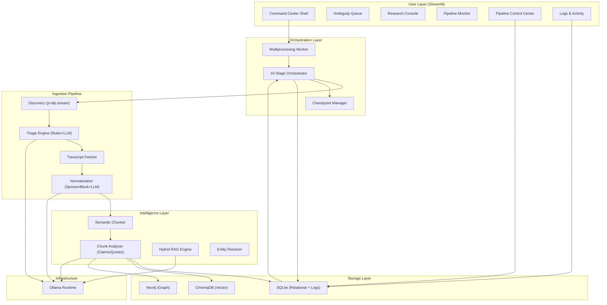

# KnowledgeVault-YT: System Architecture and Technical Specification

## Overview

KnowledgeVault-YT is a local-first research intelligence system designed to transform fragmented YouTube content into a structured, searchable Knowledge Graph. The platform solves the Knowledge Density Gap—the systemic friction between engagement-optimized video design and a researcher's need for structured, queryable intelligence.

Every architectural decision addresses three core friction points:

| Friction Point | Architectural Response |
|---|---|
| High Noise-to-Signal Ratio | Multi-stage Triage Engine with LLM metadata classification and SponsorBlock filtering. |
| Temporal Fragmentation | Cross-channel Guest and Topic Graph (Neo4j) linking entities across time and platforms. |
| Search Limitations | RAG-powered Semantic Search over vector-embedded transcript chunks with timestamp citations. |

---

## 1. System Architecture

The system follows a pipeline architecture with three major subsystems:

1.  **Ingestion Pipeline**: Discovers, triages, and refines YouTube content using local LLMs and external APIs.
2.  **Hybrid Storage**: A three-layer data architecture combining relational (SQLite), vector (ChromaDB), and graph (Neo4j) databases.
3.  **Intelligence Layer**: Provides RAG synthesis, entity resolution, and automated insight generation.

### System Architecture Diagram

---

## 2. Ingestion Pipeline

The pipeline processes each video through sequential stages. Each stage transition is committed to SQLite, enabling crash-safe resume capabilities.

### 2.1 Discovery Engine

The Discovery Engine accepts single video URLs, playlists, or channel URLs and normalizes them into a unified video-ID queue.

*   **URL Parsing**: Distinguishes between video, playlist, and channel patterns.
*   **Metadata Extraction**: Uses `yt-dlp` to extract comprehensive metadata including titles, descriptions, upload dates, and view counts without downloading media.
*   **Deduplication**: Uses SQLite unique constraints to prevent re-processing of already discovered videos.

### 2.2 Triage Engine

The Triage Engine reduces noise through a two-phase process:

1.  **Phase 1: Rule-Based Pre-Filter**: Immediately accepts or rejects videos based on duration, verified channel whitelists, or educational keyword matches in titles.
2.  **Phase 2: LLM Metadata Classifier**: High-confidence classification using local LLMs (e.g., Llama-3-8B) to determine if content is "Knowledge-Dense" or "Noise."

### 2.3 Refinement Layer

*   **Transcript Acquisition**: Priority-ordered fetching (manual English -> auto English -> manual any -> auto any).
*   **SponsorBlock Integration**: Automatically strips sponsored segments, intros, and outros using crowd-sourced data.
*   **Text Normalization**: Uses LLMs to remove verbal fillers ("um", "uh"), fix punctuation, and merge broken sentence boundaries while preserving factual content.

---

## 3. Hybrid Data Architecture

### 3.1 Relational Layer (SQLite)

SQLite serves as the primary store for structured metadata, pipeline checkpoints, and activity logs.

*   **Concurrency**: Uses Write-Ahead Logging (WAL) mode to enable concurrent reads from the UI while the pipeline is writing.
*   **Checkpointing**: Tracks the specific pipeline stage of each video to support granular resumption.

### 3.2 Vector Layer (ChromaDB)

ChromaDB stores semantic embeddings of transcript chunks.

*   **Chunking Strategy**: A 400-word sliding window with 80-word overlap preserves context across chunk boundaries.
*   **Embeddings**: Uses `nomic-embed-text` (768-dim) via Ollama for local semantic representation.

### 3.3 Graph Layer (Neo4j)

The Graph Layer maps relationships between entities, topics, and videos, resolving the issue of information fragmentation across channels.

*   **Entity Resolution**: Identifies when the same guest appears across different channels using fuzzy matching and LLM disambiguation.
*   **Knowledge Extraction**: Maps "Discusses" relationships between videos and topics, and "Expert on" relationships for guests.
*   **Insight Generation**: The "Epiphany Engine" identifies consensus, contradictions, or evolution of topics across different sources.

---

## 4. Intelligence and Interaction

### 4.1 Hybrid RAG Engine

The Retrieval-Augmented Generation (RAG) engine combines multiple search strategies for maximum retrieval accuracy:

1.  **Semantic Search**: ChromaDB vector similarity lookup.
2.  **Full-Text Search**: SQLite FTS5 BM25 search for exact term matching.
3.  **Reciprocal Rank Fusion (RRF)**: Merges vector and text results into a single ranked list.
4.  **Synthesis**: Uses Llama-3-8B to generate a comprehensive answer based on retrieved chunks, including citations and timestamped links.

### 4.2 Map-Reduce Summarization

To handle long-form content, the system employs a Map-Reduce approach:
1.  **Map Phase**: Summarizes individual chunk groups into dense bullet points.
2.  **Reduce Phase**: Synthesizes all summaries into a structured final report including a narrative summary, key takeaways, and a thematic timeline.

---

## 5. Resilience and Performance

### 5.1 Checkpoint and Resume

Every stage transition is atomically committed. If a process is interrupted, the orchestrator can resume from the exact stage for each video. 

### 5.2 Performance Benchmarks

| Operation | Target |
|---|---|
| Metadata Harvest | < 500ms per video |
| LLM Triage | < 2s per video |
| Transcript Acquisition | < 3s |
| Text Normalization | < 5s per 1000 words |
| Embedding | < 100ms per chunk |
| RAG Query | < 8s (End-to-End) |

### 5.3 Hardware Requirements

| Component | Minimum | Recommended |
|---|---|---|
| CPU | 4-core x86_64 | 8-core |
| RAM | 16 GB | 32 GB |
| GPU | CPU-only viable | 8 GB VRAM (RTX 3060+) |
| Storage | 20 GB free | 50 GB SSD |

---

## 6. Technology Stack

| Layer | Technology |
|---|---|
| Runtime | Python 3.11+ |
| LLM Host | Ollama |
| Models | Llama 3.1/3.2 (3B & 8B) |
| Embedding | nomic-embed-text |
| Relational DB | SQLite (WAL mode) |
| Vector DB | ChromaDB |
| Graph DB | Neo4j Community |
| UI Framework | Streamlit |
| Extraction | yt-dlp, youtube-transcript-api |
