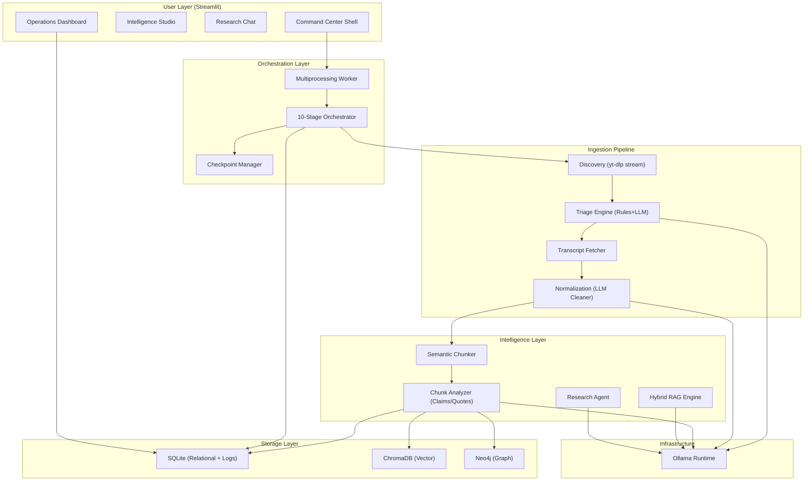

# KnowledgeVault-YT: System Architecture and Technical Specification

## Overview

KnowledgeVault-YT is a local-first research intelligence system designed to transform fragmented YouTube content into a structured, searchable Knowledge Graph. The platform solves the Knowledge Density Gap—the systemic friction between engagement-optimized video design and a researcher's need for structured, queryable intelligence.

Every architectural decision addresses three core friction points:

| Friction Point | Architectural Response |
|---|---|
| High Noise-to-Signal Ratio | Multi-stage Triage Engine with LLM metadata classification and SponsorBlock filtering. |
| Temporal Fragmentation | Cross-channel Guest and Topic Graph (Neo4j) linking entities across time and platforms. |
| Search Limitations | Hybrid RAG Engine over vector-embedded transcript chunks with timestamp citations. |

---

## 1. System Architecture

The system follows a pipeline architecture with three major subsystems:

1.  **Ingestion Pipeline**: Discovers, triages, and refines YouTube content using local LLMs and external APIs.
2.  **Hybrid Storage**: A three-layer data architecture combining relational (SQLite), vector (ChromaDB), and graph (Neo4j) databases.
3.  **Intelligence Layer**: Provides RAG synthesis, autonomous research agents, and automated insight generation.

### System Architecture Diagram

---

## 2. Ingestion Pipeline

The pipeline processes each video through 10 sequential stages. Each stage transition is committed to SQLite, enabling crash-safe resume capabilities.

### 2.1 Discovery Engine
Normalizes single URLs, playlists, or channels into a unified video-ID queue.

### 2.2 Triage Engine
Reduces noise through a two-phase process:
1.  **Phase 1: Rule-Based Pre-Filter**: Duration, whitelists, and keyword matches.
2.  **Phase 2: LLM Metadata Classifier**: High-confidence classification using local LLMs (e.g., Llama 3.2).

### 2.3 Refinement Layer
- **Transcript Acquisition**: Multi-source fetching with fallback logic.
- **Text Normalization**: LLM-based cleaning of verbal fillers and punctuation errors.

---

## 3. Hybrid Data Architecture

### 3.1 Relational Layer (SQLite)
Primary store for structured metadata, pipeline checkpoints, and activity logs. Uses WAL mode for concurrent access.

### 3.2 Vector Layer (ChromaDB)
Stores semantic embeddings of transcript chunks using `nomic-embed-text` (768-dim) via Ollama.

### 3.3 Graph Layer (Neo4j)
Maps relationships between entities, topics, and videos. Resolves guests across channels and identifies "Thematic Bridges" via the Epiphany Engine.

---

## 4. Intelligence and Interaction

### 4.1 Hybrid RAG Engine
Combines vector similarity search (ChromaDB) with full-text search (SQLite FTS5) using Reciprocal Rank Fusion (RRF).

### 4.2 Research Agent
An autonomous engine that deep-scans the vault for a given query, performs multi-step retrieval, and synthesizes a formal research paper.

### 4.3 Epiphany Engine
An automated graph-scanning utility that identifies cross-channel consensus, contradictions, and non-obvious thematic connections.

---

## 5. Technology Stack

| Layer | Technology |
|---|---|
| Runtime | Python 3.11+ |
| LLM Host | Ollama |
| Models | Llama 3.2 (3B) / Llama 3.1 (8B) |
| Embedding | nomic-embed-text |
| Relational DB | SQLite (WAL mode) |
| Vector DB | ChromaDB |
| Graph DB | Neo4j Community |
| UI Framework | Streamlit |
| Extraction | yt-dlp, youtube-transcript-api |

---

## 6. Performance Targets

| Operation | Target |
|---|---|
| Metadata Harvest | < 500ms per video |
| LLM Triage | < 2s per video |
| RAG Query | < 8s (End-to-End) |
| Agent Report | < 30s (Autonomous) |
